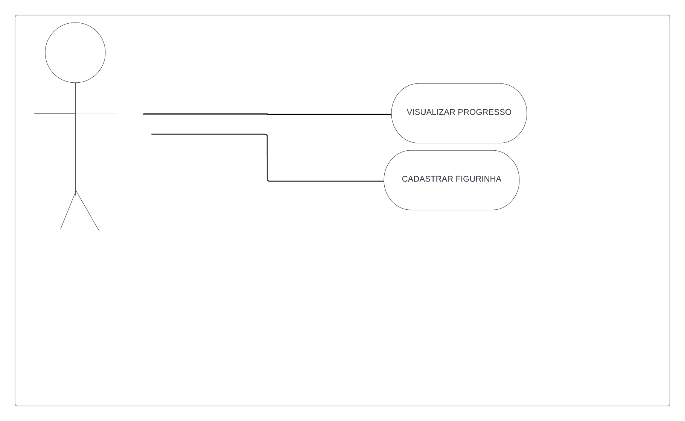

**Data:14/08**

"We see three critical differences between programming and software engineering: time, scale, and the trade-offs at play. On a software engineering project, engineers need to be more concerned with the passage of time and the eventual need for change. In a software engineering organization, we need to be more concerned about scale and efficiency, both for the software we produce as well as for the organization that is producing it. Finally, as software engineers, we are asked to make more complex decisions with higher-stakes outcomes, often based on imprecise estimates of time and growth. Within Google, we sometimes say, “Software engineering is programming integrated over time.” Programming is certainly a significant part of software engineering: after all, programming is how you generate new software in the first place. If you accept this distinction, it also becomes clear that we might need to delineate between programming tasks (development) and software engineering tasks (development, modification, maintenance). The addition of time adds an important new dimension to programming. Cubes aren’t squares, distance isn’t velocity. Software engineering isn’t programming."

Titus Winters, Software Engineering at Google

Asiim como um mecânico monta um um carro e um engenheiro o desenvolve no papel e planeja suas futuras manutenções e possiveis falhas, um programador desenvolve o código e um engenheiro de software planeja toda sua arquitetura e manutenção de código, sendo assim programar esta ligado há engenharia de software, porém engenharia de software vai além de programar, está ligado também a futura manutenção de código e planejamento de arquitetura.

Gabriel da Silva Vieira - github.com/DevBielgrazi

**Data:19/08**
Requisitos funcionais:
>Adicionar figurinhas já coletadas 
>Visualizar figurinhas faltantes 
>Compartilhar informações com amigos

Requisitos não-funcionais:
>Paleta de cores baseada no mundial 

<b>Diagrama de Caso e Uso 

<b>Diagrama Sequencial 

<b>Diagrama de Classes 

<b>Classe Usuario 

<b>Classe UsuarioDAO 

<b>Classe Pais 

<b>Classe PaisDAO 

<b>Classe AlbumDAO 

